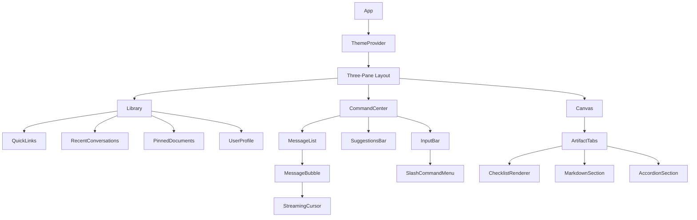
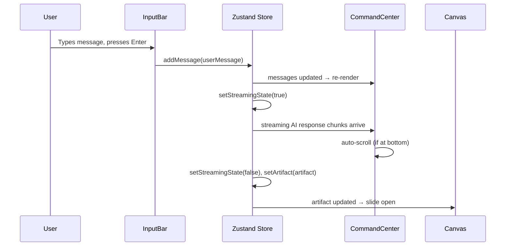

# Design Document: Nexora Command & Canvas UI

## Overview

Nexora is a React + TypeScript single-page application built around a three-pane split-screen layout. The application provides a unified AI workflow workspace: a **Library** sidebar for navigation and quick access, a **Command Center** for conversational AI interaction, and a **Canvas** pane for viewing and editing structured AI-generated artifacts.

The design is built on **Shadcn/ui** (Radix UI primitives + Tailwind CSS), uses **Zustand** for global client state, and targets WCAG 2.1 AA accessibility throughout. The entire UI is theme-aware (light/dark), persisted in `localStorage`, and responsive down to mobile viewports.

### Key Design Decisions

- **Shadcn/ui over a traditional component library**: Components are copied into the codebase as TypeScript source, giving full control over styling and behavior without fighting library overrides. Radix UI primitives provide accessible headless behavior (focus traps, ARIA, keyboard nav) for free.
- **Zustand over Redux or Context API**: The application has moderate global state (conversations, canvas artifact, theme, pinned docs). Zustand provides fine-grained subscriptions with minimal boilerplate and excellent TypeScript support — avoiding the re-render cascades of Context API and the ceremony of Redux.
- **CSS transitions at 150ms**: All interactive state changes (hover, focus, theme switch, canvas slide) use a single `transition-all duration-150` Tailwind class for visual consistency.
- **Smart auto-scroll via Intersection Observer**: An invisible sentinel element at the bottom of the message list is observed; auto-scroll is suppressed when the sentinel is not in view (user has scrolled up).
- **fast-check for property-based testing**: The JavaScript/TypeScript PBT library that integrates with Vitest, enabling 100+ iteration property tests for pure logic functions.

---

## Architecture

### High-Level Structure

```
src/
├── app/
│   ├── App.tsx                  # Root layout, theme provider, store init
│   └── main.tsx                 # Entry point, theme pre-load script
├── components/
│   ├── library/
│   │   ├── Library.tsx          # Left sidebar container
│   │   ├── QuickLinks.tsx       # Quick link icon grid
│   │   ├── RecentConversations.tsx
│   │   ├── PinnedDocuments.tsx
│   │   └── UserProfile.tsx
│   ├── command-center/
│   │   ├── CommandCenter.tsx    # Center pane container
│   │   ├── MessageList.tsx      # Scrollable message list + auto-scroll
│   │   ├── MessageBubble.tsx    # Individual message renderer
│   │   ├── StreamingCursor.tsx  # Pulsing cursor animation
│   │   ├── SuggestionsBar.tsx   # Suggestion pills row
│   │   └── InputBar.tsx         # Auto-expanding textarea + actions
│   │       └── SlashCommandMenu.tsx
│   └── canvas/
│       ├── Canvas.tsx           # Right pane container + slide transition
│       ├── ArtifactTabs.tsx     # Tab navigation per artifact section
│       ├── ChecklistRenderer.tsx
│       ├── MarkdownSection.tsx  # Renderer/editor toggle
│       └── AccordionSection.tsx
├── store/
│   ├── useAppStore.ts           # Zustand store (conversations, canvas, theme, pins)
│   └── types.ts                 # Shared TypeScript types
├── hooks/
│   ├── useAutoScroll.ts         # Smart scroll logic
│   ├── useTheme.ts              # Theme read/write with localStorage
│   └── useSlashCommand.ts       # Slash command detection + menu state
├── lib/
│   ├── markdown.ts              # Markdown parse/render utilities
│   ├── download.ts              # Artifact download logic
│   └── utils.ts                 # cn() helper, misc utilities
└── styles/
    └── globals.css              # Tailwind base, CSS variables for theme tokens
```

### Component Hierarchy



### State Flow



### Responsive Behavior

| Viewport | Library | Command Center | Canvas |
|---|---|---|---|
| ≥ 768px | Visible (fixed width) | Flexible center | Visible when open |
| < 768px | Hidden (collapsed) | Full width | Hidden (collapsed) |

At < 768px, Library and Canvas are hidden via `hidden md:flex` Tailwind classes. A mobile menu button can reveal the Library as an overlay sheet (Shadcn `Sheet` component).

---

## Components and Interfaces

### Layout

The root layout uses CSS Grid with three named columns:

```tsx
// Three-pane grid: Library | CommandCenter | Canvas
<div className="grid h-screen overflow-hidden"
     style={{ gridTemplateColumns: 'var(--library-width) 1fr var(--canvas-width)' }}>
```

CSS variables `--library-width` (240px fixed) and `--canvas-width` (0px or 420px) are animated via CSS transitions to achieve the 150ms slide effect.

### Library Sidebar

**QuickLinks**: A 3×2 icon grid. Each link is an `<a target="_blank" rel="noopener noreferrer">` wrapping a Shadcn `Button` variant="ghost". Services: GitHub, Calendar, Gmail, Drive, Notion, Slack.

**RecentConversations**: Renders up to 10 items from `store.conversations`. Each item shows title + relative timestamp (computed via `Intl.RelativeTimeFormat`). Empty state: "No recent conversations." Clicking dispatches `store.loadConversation(id)`.

**PinnedDocuments**: Renders `store.pinnedArtifacts`. Empty state: "No pinned documents." Clicking dispatches `store.openArtifact(artifact)` which opens the Canvas.

**UserProfile**: Displays avatar `` with `onError` fallback to initials rendered in a colored `<div>`. Settings icon (Shadcn `Button` variant="ghost", `size="icon"`) opens a settings sheet.

### Command Center

**MessageList**: A `<div ref={scrollRef} className="overflow-y-auto flex-1">` containing mapped `MessageBubble` components plus an invisible `<div ref={sentinelRef}>` at the bottom. The `useAutoScroll` hook observes the sentinel.

**MessageBubble**:
- AI messages: `bg-slate-50 dark:bg-slate-800`, left-aligned, no border
- User messages: `bg-indigo-600 dark:bg-indigo-500 text-white`, right-aligned, rounded-2xl
- Streaming AI message appends `<StreamingCursor>` at the end

**StreamingCursor**: A `<span>` with `animate-pulse` (Tailwind) and a 1s animation cycle. Rendered only when `store.isStreaming && message.id === store.streamingMessageId`.

**SuggestionsBar**: A horizontal flex row of `<Button variant="outline">` pills with `rounded-full`. Default pills: "Summarize my day", "Review pending tasks", "Search my links" (plus up to 3 more). Clicking calls `store.setInputValue(pill.prompt)` and focuses the InputBar.

**InputBar**: A `<textarea>` wrapped in a styled container. Uses `useSlashCommand` hook for slash detection. Action buttons (attachment, web-search toggle, send) are inline at the bottom-right. The textarea auto-expands by setting `rows` dynamically based on line count, capped at 6 rows.

**SlashCommandMenu**: A Radix UI `Popover` anchored to the InputBar. Contains a listbox of commands (/task, /note, /link, /search). Focus is trapped inside via Radix's built-in focus management. Arrow keys navigate items; Escape dismisses and returns focus to InputBar.

### Canvas Pane

**Canvas**: Slides open/closed by toggling `--canvas-width` between `0px` and `420px` with `transition: width 150ms ease`. Contains a close button, `ArtifactTabs`, and action buttons (Pin, Download).

**ArtifactTabs**: Radix UI `Tabs` component. Each tab maps to an artifact section. Active tab uses `text-indigo-600 dark:text-indigo-400 border-b-2 border-indigo-600`.

**ChecklistRenderer**: Maps checklist items to `<label>` + `<input type="checkbox">` pairs. Checked state is stored in component state (session-persistent, reset on page reload). ARIA: `role="checkbox"` with `aria-checked`.

**MarkdownSection**: Renders markdown via a lightweight parser (e.g., `marked` or `react-markdown`). Click on the rendered area switches to a `<textarea>` editor. `onBlur` on the textarea switches back to rendered mode and updates the artifact content in the store.

**AccordionSection**: Radix UI `Accordion` with `type="multiple"` and all items open by default. Toggle animation uses `data-[state=open]:animate-accordion-down` at 150ms.

---

## Data Models

```typescript
// store/types.ts

export type Theme = 'light' | 'dark';

export interface Message {
  id: string;
  role: 'user' | 'assistant';
  content: string;
  timestamp: Date;
  isStreaming?: boolean;
}

export interface Conversation {
  id: string;
  title: string;
  messages: Message[];
  createdAt: Date;
  updatedAt: Date;
}

export type ArtifactSectionType = 'checklist' | 'markdown' | 'accordion';

export interface ChecklistItem {
  id: string;
  text: string;
  checked: boolean;
}

export interface AccordionItem {
  id: string;
  title: string;
  content: string;
}

export interface ArtifactSection {
  id: string;
  title: string;           // Tab label
  type: ArtifactSectionType;
  // Only one of these will be populated based on type:
  checklistItems?: ChecklistItem[];
  markdownContent?: string;
  accordionItems?: AccordionItem[];
}

export interface Artifact {
  id: string;
  title: string;
  sections: ArtifactSection[];
  generatedAt: Date;
  isPinned: boolean;
}

export interface QuickLink {
  id: string;
  label: string;
  url: string;
  icon: React.ComponentType;
}

export interface UserProfile {
  id: string;
  name: string;
  avatarUrl?: string;
}

// Zustand store shape
export interface AppState {
  // Theme
  theme: Theme;
  setTheme: (theme: Theme) => void;

  // Conversations
  conversations: Conversation[];
  activeConversation: Conversation | null;
  loadConversation: (id: string) => void;
  addMessage: (message: Omit<Message, 'id' | 'timestamp'>) => void;

  // Streaming
  isStreaming: boolean;
  streamingMessageId: string | null;
  setStreamingState: (streaming: boolean, messageId?: string) => void;
  appendStreamChunk: (chunk: string) => void;

  // Canvas
  isCanvasOpen: boolean;
  activeArtifact: Artifact | null;
  openArtifact: (artifact: Artifact) => void;
  closeCanvas: () => void;
  updateArtifactSection: (sectionId: string, content: Partial<ArtifactSection>) => void;
  toggleChecklistItem: (sectionId: string, itemId: string) => void;

  // Pinned documents
  pinnedArtifacts: Artifact[];
  pinArtifact: (artifact: Artifact) => void;
  unpinArtifact: (artifactId: string) => void;

  // Input bar
  inputValue: string;
  setInputValue: (value: string) => void;

  // User
  user: UserProfile | null;
}
```

### Theme Persistence

Theme is stored in `localStorage` under the key `nexora-theme`. A blocking inline `<script>` in `index.html` reads this value and applies `class="dark"` to `<html>` before React hydrates, preventing any flash of the wrong theme:

```html
<script>
  (function() {
    var t = localStorage.getItem('nexora-theme');
    if (t === 'dark') document.documentElement.classList.add('dark');
  })();
</script>
```

Tailwind's `darkMode: 'class'` strategy is used throughout.

### Checklist State

Checklist item `checked` state lives in the Zustand store under `activeArtifact.sections[n].checklistItems`. It is session-persistent (survives re-renders) but not persisted to `localStorage` — it resets on page reload, matching the requirement.

### Download Format

When the user clicks Download, `lib/download.ts` assembles a Markdown string:

```
# {artifact.title}

## {section.title}

{section content rendered as markdown}

---
```

The filename is derived from the artifact title: `artifact.title.toLowerCase().replace(/\s+/g, '-') + '.md'`.

---

## Correctness Properties

*A property is a characteristic or behavior that should hold true across all valid executions of a system — essentially, a formal statement about what the system should do. Properties serve as the bridge between human-readable specifications and machine-verifiable correctness guarantees.*

**Property Reflection**: After reviewing all testable criteria, the following consolidations were made:
- Requirements 3.4 and 3.8 both test the `shouldAutoScroll` function (at-bottom → scroll, not-at-bottom → no scroll). These are combined into one property covering the full input space.
- Requirements 7.2 and 7.3 (pin/unpin) are complementary round-trip operations and are kept as separate properties since they test distinct state transitions, but together they form a round-trip property.
- Requirements 6.5 and 6.10 (checklist toggle, accordion toggle) both test a "toggle flips one item, leaves others unchanged" invariant. They are kept separate because they operate on different data structures.
- Requirements 11.3 and 11.6 both concern ARIA correctness. 11.3 tests initial render; 11.6 tests state updates. These are combined into one comprehensive ARIA property.

---

### Property 1: Recent Conversations List Rendering

*For any* array of conversations (including empty arrays and arrays with more than 10 items), the rendered Library conversation list SHALL display at most 10 items, each showing its title and a relative timestamp. When the array is empty, the empty state text "No recent conversations." SHALL be displayed.

**Validates: Requirements 2.3**

---

### Property 2: Pinned Documents List Rendering

*For any* array of pinned artifacts (including empty arrays), the rendered Library pinned documents section SHALL display each artifact's title. When the array is empty, the empty state text "No pinned documents." SHALL be displayed.

**Validates: Requirements 2.5**

---

### Property 3: User Profile Avatar Fallback

*For any* UserProfile object, the Library user profile section SHALL render an avatar `` element when `avatarUrl` is present and non-empty, and SHALL render the user's initials as text when `avatarUrl` is absent or empty.

**Validates: Requirements 2.7**

---

### Property 4: Message Chronological Order

*For any* array of messages with distinct timestamps, the rendered message list SHALL display messages in ascending chronological order (oldest first, newest last).

**Validates: Requirements 3.1**

---

### Property 5: AI Message Background Class

*For any* AI assistant message, the rendered message bubble SHALL have the `bg-slate-50` class applied in light theme and the `bg-slate-800` class applied in dark theme.

**Validates: Requirements 3.2**

---

### Property 6: User Message Alignment

*For any* user message, the rendered message bubble SHALL have a right-alignment class applied and a background class that differs from the AI message background class.

**Validates: Requirements 3.3**

---

### Property 7: Smart Auto-Scroll Decision

*For any* scroll container state (scrollTop, scrollHeight, clientHeight), the `shouldAutoScroll` function SHALL return `true` if and only if the user is at or near the bottom of the scroll container (within a threshold), and SHALL return `false` when the user has scrolled up beyond the threshold.

**Validates: Requirements 3.4, 3.8**

---

### Property 8: Streaming Chunk Concatenation

*For any* sequence of string chunks delivered during streaming, the final message content in the store SHALL equal the concatenation of all chunks in the order they were received.

**Validates: Requirements 3.6**

---

### Property 9: Suggestion Pill Input Population

*For any* suggestion pill with a prompt string, clicking that pill SHALL set the store's `inputValue` to exactly that pill's prompt string, overwriting any previous content.

**Validates: Requirements 4.2**

---

### Property 10: Suggestions Bar Always Rendered

*For any* application state (empty messages, active conversation, streaming in progress), the SuggestionsBar component SHALL be present in the rendered output.

**Validates: Requirements 4.6**

---

### Property 11: Input Bar Row Capping

*For any* text input with N lines of content, the computed `rows` attribute of the textarea SHALL equal `min(N, 6)`, ensuring the textarea never expands beyond 6 visible lines.

**Validates: Requirements 5.1**

---

### Property 12: Slash Command Trigger Detection

*For any* string value in the input bar and any cursor position, the `shouldShowSlashMenu` function SHALL return `true` if and only if the character immediately before the cursor is "/" and that "/" is either at the start of the input or preceded by a whitespace character.

**Validates: Requirements 5.2**

---

### Property 13: Slash Command Text Replacement

*For any* input string containing a slash trigger followed by optional partial text, and any selected slash command, the `replaceSlashCommand` function SHALL return a string where the slash trigger and any partial text are replaced by the selected command text, with all other content preserved.

**Validates: Requirements 5.3**

---

### Property 14: Send Button Disabled on Whitespace Input

*For any* string value in the input bar, the `isSubmittable` function SHALL return `false` if the string contains only whitespace characters (including empty string), and SHALL return `true` if the string contains at least one non-whitespace character.

**Validates: Requirements 5.5**

---

### Property 15: Artifact Tab Count Matches Section Count

*For any* Artifact with N sections, the rendered Canvas tab navigation SHALL display exactly N tabs, and each tab's label SHALL match the corresponding section's title.

**Validates: Requirements 6.2**

---

### Property 16: Checklist Items Render Checkboxes

*For any* checklist-type ArtifactSection with N items, the rendered ChecklistRenderer SHALL display exactly N checkbox elements, each associated with its item's text.

**Validates: Requirements 6.4**

---

### Property 17: Checklist Toggle Invariant

*For any* checklist section state and any item ID, calling `toggleChecklistItem` SHALL flip the `checked` boolean of the targeted item and leave all other items' `checked` values unchanged.

**Validates: Requirements 6.5**

---

### Property 18: Accordion Items Expanded by Default

*For any* accordion-type ArtifactSection with N items, all N items SHALL have an expanded state when first rendered (before any user interaction).

**Validates: Requirements 6.9**

---

### Property 19: Accordion Toggle Invariant

*For any* accordion section state and any item ID, calling the toggle action SHALL flip the expanded/collapsed state of the targeted item and leave all other items' states unchanged.

**Validates: Requirements 6.10**

---

### Property 20: Pin Artifact State Mutation

*For any* unpinned Artifact, calling `pinArtifact` SHALL add that artifact to `pinnedArtifacts`, set its `isPinned` to `true`, and leave all other artifacts in `pinnedArtifacts` unchanged.

**Validates: Requirements 7.2**

---

### Property 21: Unpin Artifact State Mutation

*For any* pinned Artifact in `pinnedArtifacts`, calling `unpinArtifact` with that artifact's ID SHALL remove it from `pinnedArtifacts`, and leave all other artifacts in `pinnedArtifacts` unchanged.

**Validates: Requirements 7.3**

---

### Property 22: Download Markdown Content Completeness

*For any* Artifact with any number of sections, the `generateMarkdown` function SHALL produce a string that contains the artifact's title, every section's title, and every section's content. The filename SHALL be derived from the artifact title (lowercased, spaces replaced with hyphens, `.md` extension).

**Validates: Requirements 7.5**

---

### Property 23: Theme Initialization from localStorage

*For any* value stored in `localStorage` under the `nexora-theme` key (including `null`, `'light'`, `'dark'`, and arbitrary strings), the `getInitialTheme` function SHALL return `'dark'` if and only if the stored value is exactly `'dark'`, and SHALL return `'light'` in all other cases.

**Validates: Requirements 9.4**

---

### Property 24: ARIA State Reflects Component State

*For any* interactive element (Tab, Accordion header, or checklist checkbox) and any sequence of state transitions, the element's ARIA state attribute (`aria-selected`, `aria-expanded`, or `aria-checked` respectively) SHALL always reflect the current logical state of that element after each transition.

**Validates: Requirements 11.3, 11.6**

---

## Error Handling

### Theme Initialization Failure
If `localStorage` is unavailable (e.g., private browsing restrictions), the theme initialization script catches the exception and defaults to light theme. No error is surfaced to the user.

### Conversation Load Failure
If `loadConversation` fails (network error, invalid ID), the store sets an `error` field and the Command Center renders an inline error message: "Failed to load conversation. Please try again." The error is dismissible.

### Artifact Download Failure
If the browser's download API fails (e.g., `Blob` creation error, `URL.createObjectURL` failure), the store sets a `downloadError` field and the Canvas renders a toast notification: "Download could not be completed." The toast auto-dismisses after 5 seconds.

### Markdown Rendering Failure
If the markdown parser throws on malformed input, the section falls back to rendering the raw markdown string in a `<pre>` block rather than crashing the component. This is handled via an error boundary wrapping `MarkdownSection`.

### Streaming Interruption
If the streaming connection is interrupted mid-response, the store sets `isStreaming: false` and appends a visual indicator to the partial message (e.g., a small warning icon with tooltip "Response interrupted"). The user can re-send the message.

### Avatar Image Load Failure
The `` element's `onError` handler sets a local state flag that switches rendering to the initials fallback. This is handled entirely in the `UserProfile` component without store involvement.

---

## Testing Strategy

### Dual Testing Approach

The testing strategy combines **unit/example-based tests** for specific behaviors and **property-based tests** for universal invariants. Both are necessary: unit tests catch concrete bugs in specific scenarios, while property tests verify general correctness across the full input space.

### Property-Based Testing

**Library**: [fast-check](https://fast-check.dev/) — the standard PBT library for JavaScript/TypeScript, compatible with Vitest.

**Configuration**: Each property test runs a minimum of **100 iterations** (fast-check default). For complex generators, use `fc.assert(fc.property(...), { numRuns: 100 })`.

**Tag format**: Each property test is tagged with a comment:
```
// Feature: nexora-command-canvas-ui, Property {N}: {property_text}
```

**Properties to implement as fast-check tests** (one test per property):

| Property | Test File | Key Arbitraries |
|---|---|---|
| 1: Recent Conversations List | `library.test.ts` | `fc.array(fc.record({id, title, updatedAt}), {maxLength: 15})` |
| 2: Pinned Documents List | `library.test.ts` | `fc.array(fc.record({id, title, isPinned: fc.constant(true)}))` |
| 3: User Profile Avatar Fallback | `library.test.ts` | `fc.record({name: fc.string(), avatarUrl: fc.option(fc.webUrl())})` |
| 4: Message Chronological Order | `message-list.test.ts` | `fc.array(fc.record({id, role, content, timestamp: fc.date()}))` |
| 5: AI Message Background Class | `message-bubble.test.ts` | `fc.record({role: fc.constant('assistant'), content: fc.string()})` |
| 6: User Message Alignment | `message-bubble.test.ts` | `fc.record({role: fc.constant('user'), content: fc.string()})` |
| 7: Smart Auto-Scroll Decision | `use-auto-scroll.test.ts` | `fc.record({scrollTop: fc.nat(), scrollHeight: fc.nat(), clientHeight: fc.nat()})` |
| 8: Streaming Chunk Concatenation | `store.test.ts` | `fc.array(fc.string(), {minLength: 1})` |
| 9: Suggestion Pill Input Population | `suggestions-bar.test.ts` | `fc.record({label: fc.string(), prompt: fc.string({minLength: 1})})` |
| 10: Suggestions Bar Always Rendered | `suggestions-bar.test.ts` | `fc.record({messages: fc.array(...), isStreaming: fc.boolean()})` |
| 11: Input Bar Row Capping | `input-bar.test.ts` | `fc.integer({min: 1, max: 20})` (line count) |
| 12: Slash Command Trigger Detection | `use-slash-command.test.ts` | `fc.string()` with cursor position |
| 13: Slash Command Text Replacement | `use-slash-command.test.ts` | `fc.string()` + `fc.constantFrom('/task', '/note', '/link', '/search')` |
| 14: Send Button Disabled on Whitespace | `input-bar.test.ts` | `fc.string()` (including `fc.stringOf(fc.char().filter(c => /\s/.test(c)))`) |
| 15: Artifact Tab Count | `artifact-tabs.test.ts` | `fc.array(fc.record({id, title, type}), {minLength: 1, maxLength: 8})` |
| 16: Checklist Items Render Checkboxes | `checklist-renderer.test.ts` | `fc.array(fc.record({id, text, checked: fc.boolean()}), {minLength: 1})` |
| 17: Checklist Toggle Invariant | `store.test.ts` | `fc.array(checklistItemArb)` + `fc.nat()` (item index) |
| 18: Accordion Items Expanded by Default | `accordion-section.test.ts` | `fc.array(fc.record({id, title, content}), {minLength: 1})` |
| 19: Accordion Toggle Invariant | `store.test.ts` | `fc.array(accordionItemArb)` + `fc.nat()` (item index) |
| 20: Pin Artifact State Mutation | `store.test.ts` | `fc.record({id, title, sections, isPinned: fc.constant(false)})` |
| 21: Unpin Artifact State Mutation | `store.test.ts` | `fc.array(artifactArb, {minLength: 1})` + `fc.nat()` (index to unpin) |
| 22: Download Markdown Completeness | `download.test.ts` | `fc.record({title: fc.string({minLength: 1}), sections: fc.array(sectionArb, {minLength: 1})})` |
| 23: Theme Initialization | `use-theme.test.ts` | `fc.option(fc.string())` (localStorage value) |
| 24: ARIA State Reflects Component State | `accessibility.test.ts` | `fc.array(fc.constantFrom('toggle', 'select', 'check'))` (action sequences) |

### Unit / Example-Based Tests

Unit tests cover specific scenarios, edge cases, and integration points not covered by property tests:

- **Rendering tests**: Empty states, specific message types, streaming cursor visibility, settings panel open/close
- **Keyboard interaction tests**: Enter to submit, Shift+Enter for newline, arrow keys in slash menu, Escape to dismiss
- **ARIA attribute tests**: `aria-label="Message input"`, focus trap in slash menu
- **Theme tests**: Dark/light class application, localStorage persistence
- **Error handling tests**: Conversation load failure message, download failure toast, avatar fallback

**Test runner**: Vitest  
**Component testing**: React Testing Library (`@testing-library/react`)  
**Accessibility testing**: `@testing-library/jest-dom` + `axe-core` via `jest-axe` (or `vitest-axe`)

### Test File Organization

```
src/
└── __tests__/
    ├── store.test.ts              # Zustand store mutations (PBT + unit)
    ├── use-auto-scroll.test.ts    # Auto-scroll hook (PBT)
    ├── use-slash-command.test.ts  # Slash command detection/replacement (PBT)
    ├── use-theme.test.ts          # Theme initialization (PBT)
    ├── download.test.ts           # Markdown generation (PBT)
    ├── library.test.ts            # Library component (PBT + unit)
    ├── message-list.test.ts       # Message ordering (PBT)
    ├── message-bubble.test.ts     # Message styling (PBT)
    ├── suggestions-bar.test.ts    # Suggestion pills (PBT + unit)
    ├── input-bar.test.ts          # Input bar behavior (PBT + unit)
    ├── artifact-tabs.test.ts      # Tab rendering (PBT)
    ├── checklist-renderer.test.ts # Checklist rendering (PBT)
    ├── accordion-section.test.ts  # Accordion rendering (PBT)
    └── accessibility.test.ts      # ARIA state (PBT + axe-core)
```

### Coverage Goals

- All 24 correctness properties covered by fast-check property tests
- All example-based acceptance criteria covered by unit tests
- Accessibility smoke tests via axe-core on key component renders
- No mocking of Zustand store in component tests — use real store with test initial state for integration fidelity
